# Deelvraag 2 — Robuustheid & offline werking: testresultaten

**Onderzoeksvraag:** Hoe kan het systeem betrouwbaar blijven functioneren en data synchroniseren bij wifi-netwerkuitval?

**Toegepaste techniek:** offline-first scanner met IndexedDB queue en automatische sync bij netwerkherstel, geïnspireerd op bron *Implementing Offline-First React Applications* en *Offline-First Mobile Architecture* (zie bronbespreking).

**Datum:** 2026-04-28
**Uitgevoerd door:** Alessio Veppi

## Implementatiekeuzes

- **Scope:** offline-first wordt enkel aan de **scanner-zijde** (bedrijf) toegepast. De student-zijde blijft online vanwege de dynamische tokens uit deelvraag 1.
- **Lokale opslag:** native IndexedDB API (database `handshake-poc`, object store `scan-queue`). Geen wrapper-library, om controle te houden over reads/writes met oog op deelvraag 3 (encryptie).
- **Datamodel queue:** `{ id, companyId, token, scannedAt }`. Het `scannedAt`-veld is een ISO-8601 UTC string, gegenereerd op moment van scannen.
- **Sync trigger:** `window.addEventListener('online', ...)` voor automatische sync, plus een knop "Nu synchroniseren" voor manuele trigger.
- **Server-side validatie:** `TokenService.TryConsumeAt(token, scannedAt)` valideert of de token geldig was op de meegestuurde scan-tijd. Offline-gesynchroniseerde scans worden gemarkeerd met `IsOfflineSynced = true` in de database.

## Bewuste afwegingen

### Hybride scan-tijd validatie (vs. strikte realtime check)

**Probleem:** dynamische tokens uit deelvraag 1 verlopen na 20 seconden. Een offline gequeuede scan kan minuten of uren later gesynchroniseerd worden, dus realtime expiry-check zou alle offline scans weigeren.

**Gekozen oplossing:** de scanner registreert `scannedAt` op het moment van de scan (niet bij sync). De server valideert tegen die historische tijd en markeert de scan met `IsOfflineSynced = true`. Een gekopieerde QR die op 14:00:05 gescand werd, wordt geaccepteerd zolang token T1 op 14:00:00 was uitgegeven (en geldig was tot 14:00:20), zelfs als de sync pas om 14:30 plaatsvindt.

**Geaccepteerd risico:** een aanvaller met een gekopieerde QR-token kan in theorie zijn browser-clock manipuleren of via DevTools een record met geforceerde `scannedAt` injecteren. De `IsOfflineSynced`-flag maakt dit echter detecteerbaar in audits, en het vereist actieve frontend-manipulatie (veel hoger drempel dan een simpele screenshot).

### Onderscheid netwerkfout vs validatiefout

Een naïeve "try → catch → queue" voegt élke gefaalde scan aan de queue toe, ook scans met een ongeldige token. Dat zou bij sync uiteindelijk falen en de queue blokkeren.

**Gekozen oplossing:** `isNetworkError(err)` helper onderscheidt HTTP 4xx-errors (server reageert maar weigert) van netwerkfouten (server onbereikbaar). Alleen netwerkfouten triggeren queueing. Tijdens sync worden 4xx-geweigerde records uit de queue verwijderd zodat ze de volgende sync niet blokkeren.

### Server-state in geheugen — bekende limitatie

Het `TokenService` houdt actieve tokens in `ConcurrentDictionary` in geheugen. Dit heeft één gevolg voor offline-scenarios:

> Als een scanner langer dan ~20 seconden offline is **én** de server in die periode geherstart wordt, gaan tokens verloren. Late-sync scans worden dan met *"Token onbekend of al gebruikt"* geweigerd.

In productie zou dit verholpen worden met:
- Een persistente token-store (Redis met TTL), of
- Cryptografisch getekende stateless tokens (JWT) met server-side replay-tracking apart.

Voor de POC wordt dit als acceptabele beperking erkend.

## Tests

### Test 1 — Backend ondersteunt scannedAt en isOfflineSynced (curl)

| # | Stap | Verwacht | Resultaat |
|---|---|---|---|
| 1.1 | POST /api/scans **zonder** `scannedAt` | 201, `isOfflineSynced: false` | ✅ |
| 1.2 | POST /api/scans **met** `scannedAt = nu+5s` | 201, `isOfflineSynced: true` | ✅ |
| 1.3 | POST /api/scans **met** `scannedAt = nu+30s` (na expiry) | 400 *"Token was verlopen op moment van scannen"* | ✅ |

**Bewijs:** screenshots van de drie backend-scenarios in Postman.

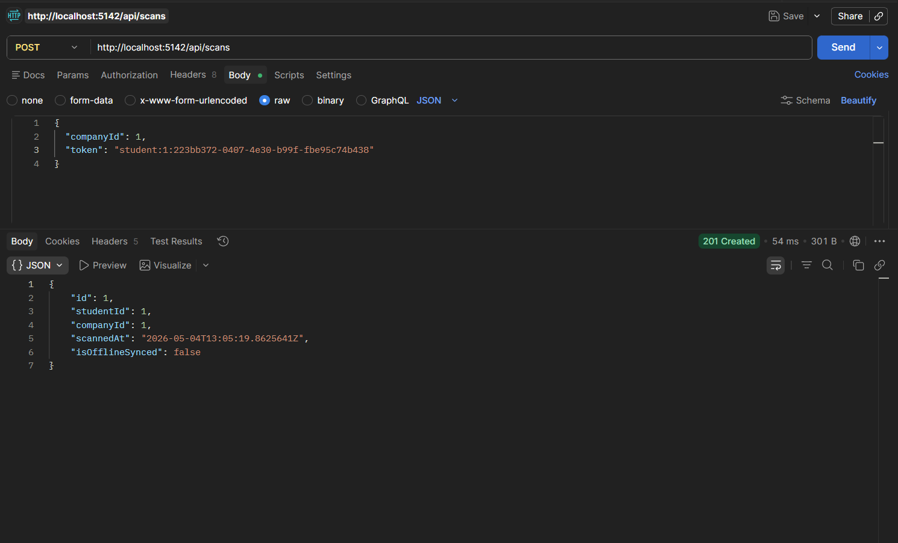
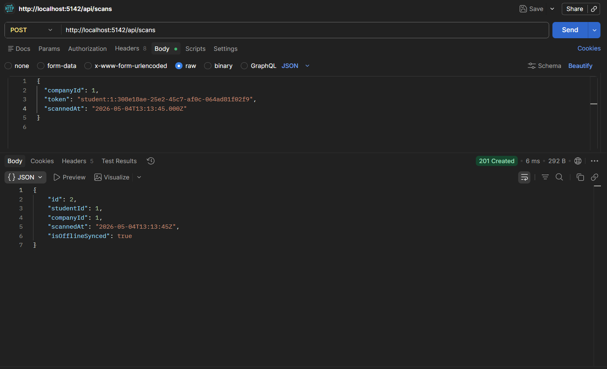
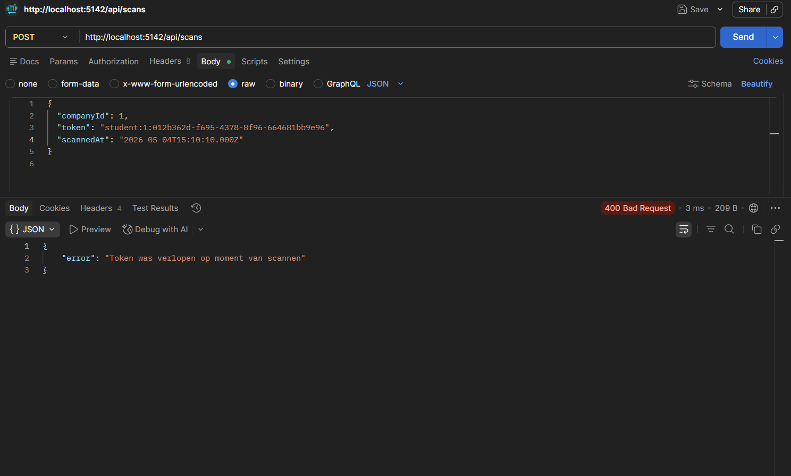

### Test 2 — Frontend: online scan via UI

| # | Stap | Verwacht | Resultaat |
|---|---|---|---|
| 2.1 | `/scanner` met netwerk → token plakken → Registreer | 201, groen vakje, **isOfflineSynced=false** in DB | ✅ |
| 2.2 | `/scanner` online → `garbage` als token | Rode error, **niets** in IndexedDB queue | ✅ |

**Bewijs:** screenshots van de online scan, controle in de database/API en de foutmelding bij een ongeldige token.

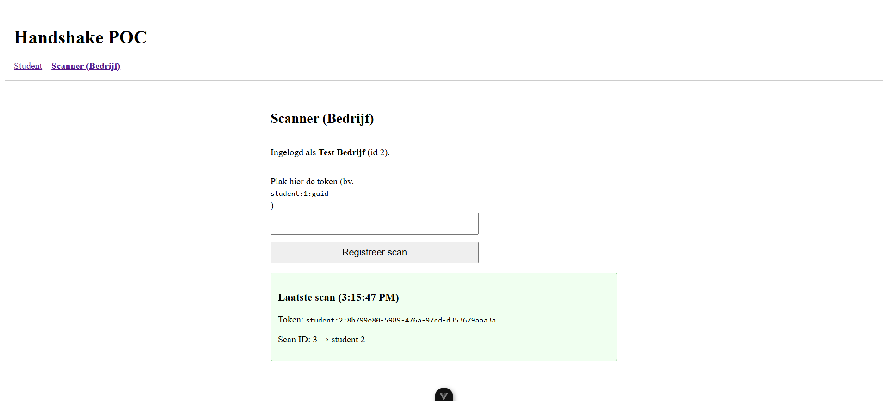

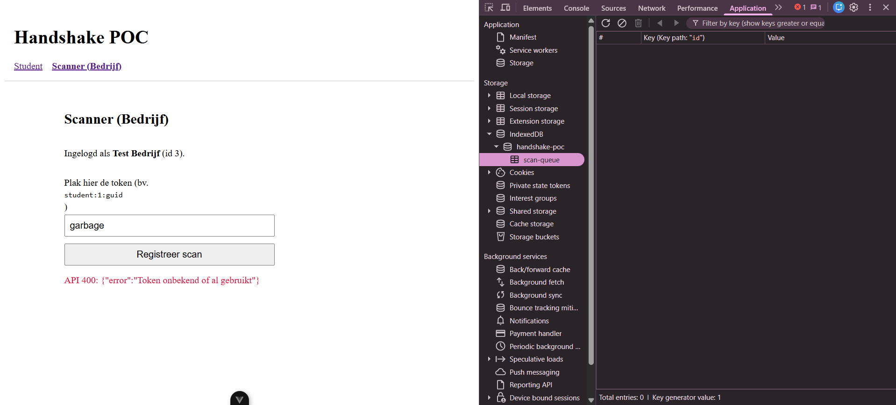

### Test 3 — Frontend: offline scans queueen

| # | Stap | Verwacht | Resultaat |
|---|---|---|---|
| 3.1 | DevTools Network → Offline | (geen netwerktraffic) | ✅ |
| 3.2 | 2 verschillende tokens scannen | Geel vakje per scan, banner "2 scan(s) in wachtrij" | ✅ |
| 3.3 | Inspectie IndexedDB → handshake-poc → scan-queue | 2 records met `companyId`, `token`, `scannedAt` | ✅ |

**Bewijs:** screenshots van offline modus, de queue-banner en de IndexedDB queue.

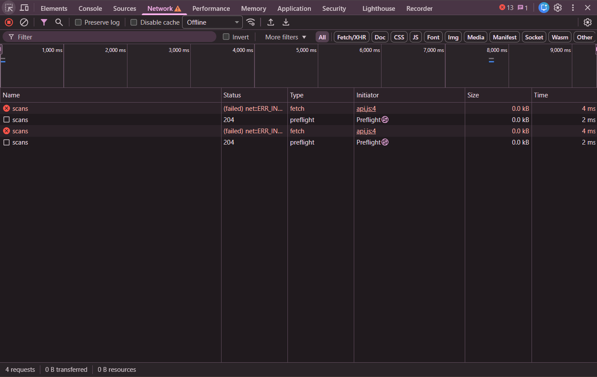
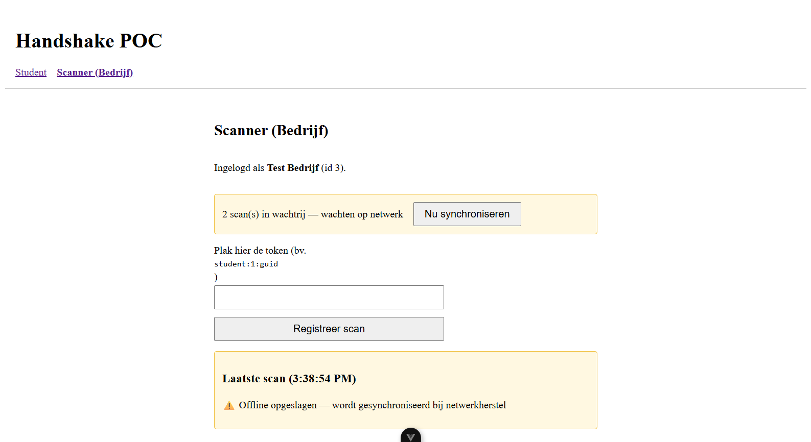
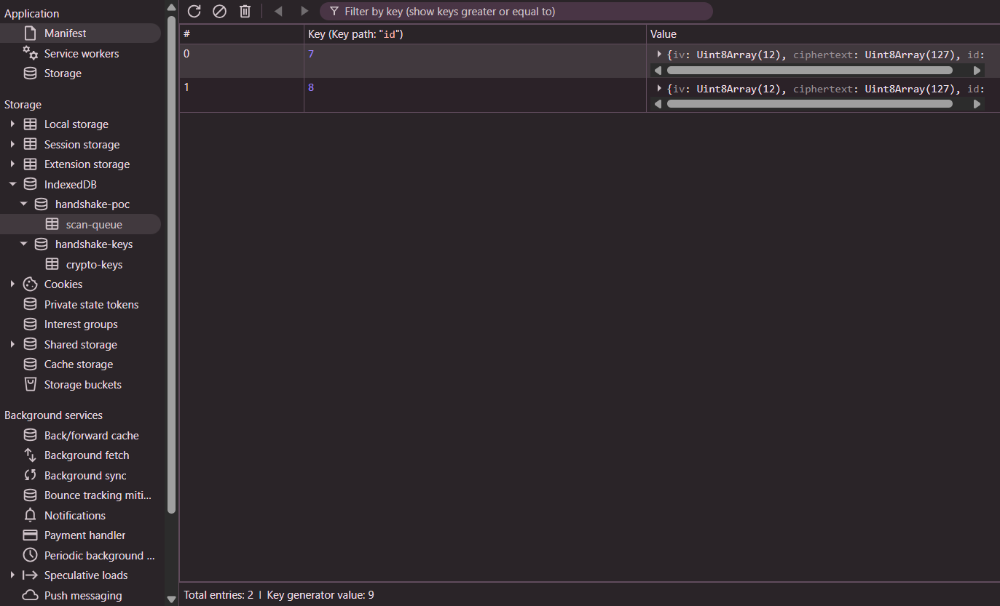

### Test 4 — Automatische sync bij netwerkherstel

| # | Stap | Verwacht | Resultaat |
|---|---|---|---|
| 4.1 | DevTools terug op "No throttling" | `online` event vuurt | ✅ |
| 4.2 | Wachten op auto-sync | Banner verdwijnt, melding "X gesynchroniseerd" | ✅ |
| 4.3 | GET /api/scans | Beide scans aanwezig met `isOfflineSynced: true` | ✅ |

**Bewijs:** screenshots van netwerkherstel, automatische synchronisatie en de gesynchroniseerde scans in de API/database.

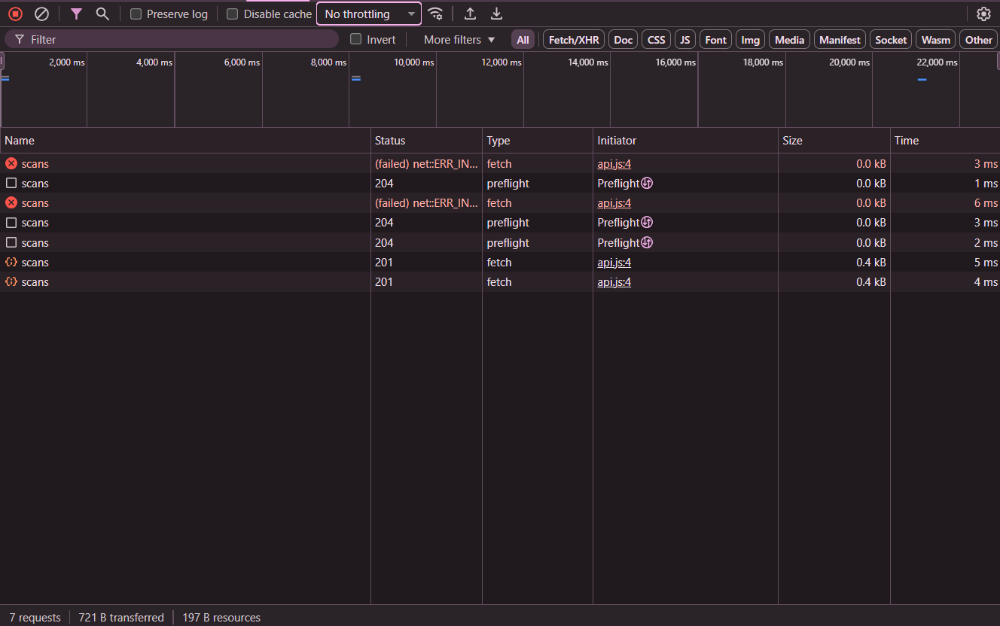
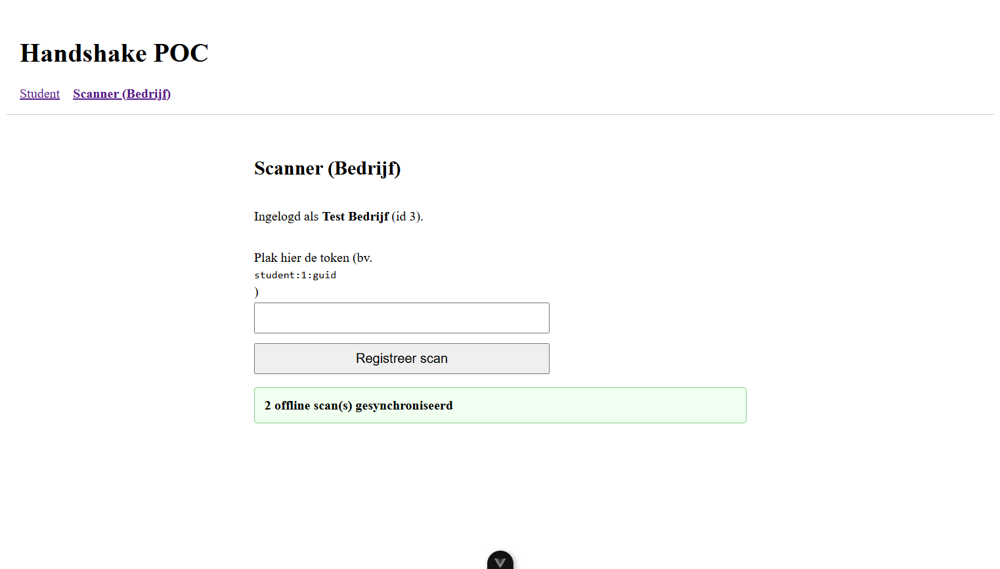
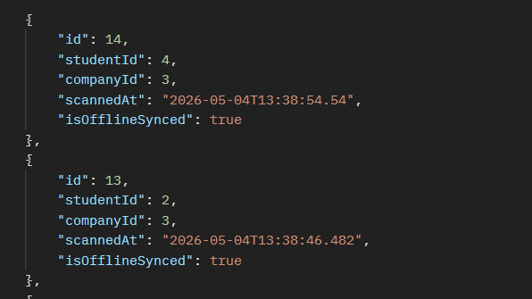

### Test 5 — Manuele sync via knop

| # | Stap | Verwacht | Resultaat |
|---|---|---|---|
| 5.1 | 1 scan in queue, online, klik "Nu synchroniseren" | Direct sync, queue → 0 | ✅ |

### Test 6 — Verlopen token tijdens late sync

| # | Stap | Verwacht | Resultaat |
|---|---|---|---|
| 6.1 | Offline → scan → wacht 30s → online → sync | Server weigert (token-state opgeruimd), record uit queue verwijderd, melding "0 gesynchroniseerd · 1 geweigerd door server" | ✅ |

**Bewijs:** screenshot van de late sync waarbij de server de verlopen token weigert en de queue wordt opgeruimd.

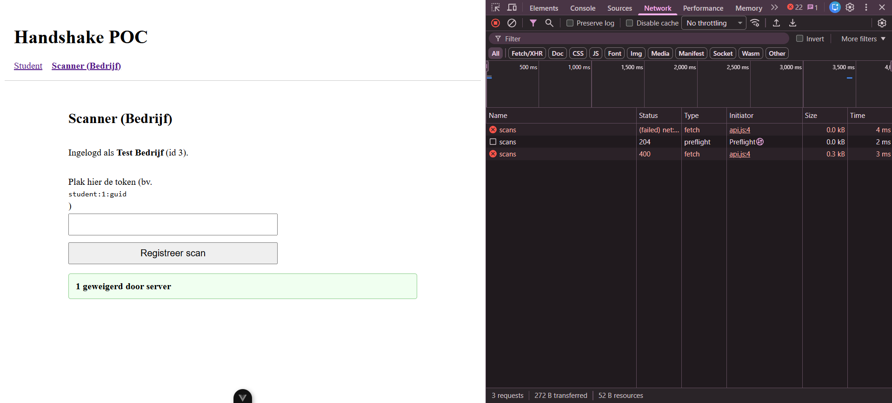

## Conclusie deelvraag 2

De combinatie van **lokale IndexedDB-queue + scannedAt-tijdstempel + automatische sync bij `online`-event** lost het robuustheidsprobleem op zonder de fraudebescherming uit deelvraag 1 op te geven:

1. **Geen dataverlies:** scans tijdens netwerkuitval worden lokaal bewaard en automatisch verzonden zodra netwerk terugkomt.
2. **Validatie blijft semantisch correct:** de server valideert tegen het tijdstip van scannen, niet van synchronisatie. Een legitieme offline-scan blijft geldig, een gekopieerde QR-screenshot blijft beperkt door de 20-seconden-window.
3. **Audit trail:** `IsOfflineSynced` markeert offline scans, zodat ze achteraf identificeerbaar zijn voor analyse of forensisch onderzoek.

**Aansluiting bij de literatuur:**
- IndexedDB + service-worker-style sync (bron: *Implementing Offline-First React Applications*) → wij gebruiken IndexedDB direct zonder service worker, omdat het scanner-scenario al volstaat met een in-tab eventlistener.
- Delta-synchronisatie (bron: *Offline-First Mobile Architecture*) → niet van toepassing in onze POC: de queue zelf is al een delta van "wat is er nog niet gesynchroniseerd".
- Bestand-versiebeheer (bron: *Offline File Sync Developer Guide 2024*) → niet van toepassing, scans zijn append-only en hebben geen conflictresolutie nodig.

**Beperkingen om in productie te verhelpen:**
- Server-state in geheugen → in productie naar Redis of stateless JWT.
- Geen retry-strategie bij sync-fouten anders dan "geweigerd"-melding → in productie exponential backoff + dead-letter-queue.
- IndexedDB data is **nog niet versleuteld** → wordt opgelost in deelvraag 3 (zie `deelvraag-3-gdpr.md`).

